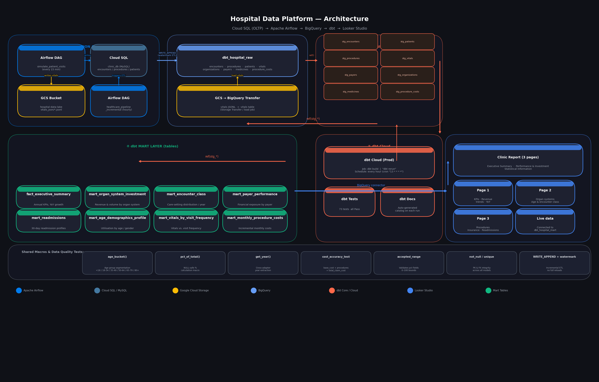

# 🏥 Hospital Data Pipeline

An end-to-end data engineering project simulating a realistic healthcare analytics platform. Data flows from an OLTP clinic database through cloud-based ingestion, transformation, and visualization layers — fully orchestrated, tested, and documented.

> **Stack:** Cloud SQL (MySQL) · Apache Airflow · Google Cloud Storage · BigQuery · dbt Cloud · Looker Studio

---

## Architecture



| Layer | Technology | Role |
|---|---|---|
| **OLTP Source** | Cloud SQL (MySQL) | Clinic transactional DB — encounters, procedures, patients |
| **Simulation** | Airflow DAG | Generates new patient visits + vitals every 15 minutes |
| **Ingestion** | Airflow DAG | Incremental ETL: CloudSQL → BigQuery (hourly, WRITE_APPEND) |
| **Object Storage** | Google Cloud Storage | Landing zone for streaming vitals JSON files |
| **Data Warehouse** | BigQuery | Three-layer medallion: raw → staging → mart |
| **Transformation** | dbt Cloud | Models, macros, seeds, tests — rebuilt hourly |
| **Visualization** | Looker Studio | 3-page executive dashboard connected to mart layer |

---

## Data Sources

### OLTP: Cloud SQL (MySQL) — `clinic_db`

Three tables fed into the pipeline via incremental Airflow extraction:

| Table | Description | Key columns |
|---|---|---|
| `encounters` | Every patient visit | `id`, `start`, `stop`, `patient`, `organization`, `payer`, `encounterclass`, `total_claim_cost` |
| `procedures` | Procedures performed per encounter | `encounter`, `patient`, `code`, `description`, `base_cost` |
| `patients` | Patient demographics | `id`, `birthdate`, `race`, `gender`, `zip` |

> Cloud SQL screenshot — the `encounters` table preview:


### dbt Seeds (static reference data)

Loaded directly into BigQuery staging via `dbt seed`:

- `organizations.csv` — clinic facilities
- `payers.csv` — insurance companies
- `medicines.csv` — medication catalog
- `procedure_costs.csv` — base cost reference

### Simulated Vitals (JSON → GCS)

A custom Airflow DAG (`simulate_patient_visits`) generates realistic patient vitals every 15 minutes and saves them as newline-delimited JSON files to GCS. These are then loaded into BigQuery raw as the `vitals` table.

```
hospital-data-lake/
  vitals_json/
    vitals_2022.jsonl          ← batch historical load
    vitals_20220205_211336_...  ← streaming micro-files (every 15 min)
```


---

## Orchestration: Apache Airflow

Two DAGs run on a GCP VM, managing all data movement.


### DAG 1 — `healthcare_pipeline_incremental`

**Schedule:** Hourly (`10 * * * *`)  
**Description:** CloudSQL MySQL → BigQuery incremental ETL  
**Tasks:** `start → extract → transform_enc + transform_proc → load → end`

The `extract` task pulls new records from Cloud SQL since the last watermark. `transform_enc` and `transform_proc` apply encoding/cleaning logic before the `load` task appends to BigQuery raw with `WRITE_APPEND`.


### DAG 2 — `simulate_patient_visits`

**Schedule:** Every 15 minutes (`*/15 * * * *`)  
**Description:** Симуляція нових візитів пацієнтів кожні 15 хвилин  
**Tasks:** `generate_data → save_to_cloudsql + save_vitals_to_gcs`

Generates synthetic encounter and vitals records, simultaneously appending to Cloud SQL (so the ETL DAG picks them up) and writing JSON vitals files directly to GCS.


---

## Data Warehouse: BigQuery

Three BigQuery datasets form a **medallion architecture**:

```
mythic-chalice-492618-h1/
├── dbt_hospital_raw/      ← raw tables (loaded by Airflow)
├── dbt_hospital_stg/      ← staging views (dbt models)
└── dbt_hospital_mart/     ← mart tables (dbt models, used by BI)
```


| Dataset | Tables | Type |
|---|---|---|
| `dbt_hospital_raw` | encounters, procedures, patients, vitals, medicines, organizations, payers, procedure_costs | Tables |
| `dbt_hospital_stg` | stg_encounters, stg_patients, stg_procedures, stg_vitals, stg_medicines, stg_organizations, stg_payers, stg_procedure_costs | Views |
| `dbt_hospital_mart` | fact_executive_summary, mart_age_demographics_profile, mart_encounter_class, mart_monthly_procedure_costs, mart_organ_system_investment, mart_payer_performance, mart_readmissions, mart_vitals_by_visit_frequency | Tables |

---

## Transformation: dbt

The dbt project (`Hospital_DBT_BigQuery`) connects to BigQuery and builds all staging and mart models from raw sources.

### Lineage Graph


**Flow:** `sources (raw tables + seeds) → stg_* models → mart_* models`

Sources are declared in `sources.yml` pointing to `dbt_hospital_raw`. Seeds are loaded directly as staging-layer reference tables.

### Project Structure

```
Hospital_DBT_BigQuery/
├── macros/
│   ├── age_bucket.sql          ← categorizes age into 18-34, 35-49, 50-64, 65-79, 80+
│   ├── get_year.sql            ← extracts year from timestamp
│   ├── pct_of_total.sql        ← calculates % share within a window
│   └── test_accepted_range.sql ← custom data test macro
├── models/
│   ├── staging/
│   │   ├── stg_encounters.sql
│   │   ├── stg_patients.sql
│   │   ├── stg_procedures.sql
│   │   ├── stg_vitals.sql
│   │   └── ...
│   └── mart/
│       ├── fact_executive_summary.sql
│       ├── mart_age_demographics_profile.sql
│       ├── mart_encounter_class.sql
│       ├── mart_organ_system_investment.sql
│       ├── mart_payer_performance.sql
│       ├── mart_readmissions.sql
│       ├── mart_vitals_by_visit_frequency.sql
│       └── mart_monthly_procedure_costs.sql
├── seeds/
│   ├── organizations.csv
│   ├── payers.csv
│   ├── medicines.csv
│   └── procedure_costs.csv
└── dbt_project.yml
```

### Example: `mart_age_demographics_profile.sql`

This mart model joins encounter and patient data, applies the `age_bucket()` macro, and aggregates by age group, gender, and organ system:

```sql
with base as (
    select
        ...
        {{ age_bucket('age_at_encounter') }}  as age_bucket
    from {{ ref('stg_encounters') }} e
    left join {{ ref('stg_patients') }} p
        on e.patient_id = p.patient_id
    where p.birth_date is not null
),

bucketed as (
    select
        *,
        {{ age_bucket('age_at_encounter') }} as age_bucket
    from base
)

select
    age_bucket,
    gender,
    organ_system,
    count(*)                    as encounter_count,
    count(distinct patient_id)  as unique_patients,
    sum(total_claim_cost)       as total_revenue,
    avg(total_claim_cost)       as avg_claim_cost
from bucketed
group by 1, 2, 3
```


### Data Tests

73 tests covering uniqueness, not-null, accepted values, and custom range checks. All passing in production.


### dbt Cloud Orchestration

A scheduled job (`dbt rerun`) runs `dbt build` every hour, regenerating all mart tables and running all tests. Docs are auto-generated on each run.


---

## Dashboards: Looker Studio

A 3-page Looker Studio report connects directly to `dbt_hospital_mart` in BigQuery.

📄 **[Full report PDF](docs/looker_report.pdf)**

### Page 1 — Executive Summary

KPIs: total revenue ($128.6M), avg revenue per encounter ($3,345.79), total encounters (27,924), revenue growth, and insurance coverage breakdowns.


### Page 2 — Performance & Investment Opportunities

Revenue trends by organ system, encounter class revenue share (treemap), and revenue + visit volume by age group.


### Page 3 — Statistical Information

Most common procedures over time, insurance coverage distribution, readmission rates by race & gender, and visit frequency segmented by vitals (heart rate × temperature).


---

## Key Design Decisions

**Incremental loading with WRITE_APPEND** — The Airflow ETL DAG appends new records to BigQuery raw rather than doing full reloads, keeping pipeline runs fast and cost-efficient as data grows.

**Dual-path vitals ingestion** — Vitals go through GCS rather than directly through the ETL DAG. This decouples high-frequency sensor-style data from transactional records and mirrors a real IoT/streaming architecture pattern.

**dbt macros for reusable logic** — Bucketing logic (`age_bucket`), percentage calculations (`pct_of_total`), and custom test ranges (`test_accepted_range`) are extracted into macros so they're reused consistently across models rather than repeated in SQL.

**Seeds for reference data** — Static lookup tables (payers, medicines, procedure costs) are managed as dbt seeds rather than external loads, keeping the transformation layer self-contained and version-controlled.

---

## Repository Structure

```
Hospital-Data-Pipeline/
├── README.md
├── docs/
│   ├── architecture.png        ← pipeline architecture diagram
│   └── looker_report.pdf       ← exported Looker Studio report
├── screenshots/
│   ├── AirFlow/
│   ├── BigQuery/
│   ├── CloudSQL__Google-Cloud-Storage/
│   └── DBT/
├── airflow_dags/
│   ├── healthcare_pipeline_incremental.py
│   └── simulate_patient_visits.py
└── dbt/
    ← full dbt project (models, macros, seeds, tests, dbt_project.yml)
```

---

## How to Run Locally

> The live BigQuery and dbt Cloud environments are no longer active (free tier). Use the screenshots and exported report to explore outputs, or recreate using the instructions below.

**Prerequisites:** GCP project with BigQuery enabled, Cloud SQL instance, Airflow 2.x, dbt Core or dbt Cloud account.

```bash
# 1. Clone the repo
git clone https://github.com/YOUR_USERNAME/Hospital-Data-Pipeline.git

# 2. Set up Airflow connections
#    - google_cloud_default: your GCP service account
#    - cloud_sql_proxy: your Cloud SQL connection string

# 3. Enable the DAGs
airflow dags unpause healthcare_pipeline_incremental
airflow dags unpause simulate_patient_visits

# 4. Run dbt
cd dbt/
dbt deps
dbt seed          # load reference tables
dbt build         # run models + tests
dbt docs generate # generate documentation
```

---

## About

Built as a portfolio project demonstrating end-to-end data engineering skills:
- Cloud infrastructure (GCP: Cloud SQL, GCS, BigQuery, Compute Engine)
- Pipeline orchestration (Apache Airflow — DAG design, scheduling, operators)
- Data modeling (dbt — staging/mart layers, macros, tests, lineage)
- Analytics engineering (dimensional modeling, incremental patterns)
- Business intelligence (Looker Studio dashboard design)
