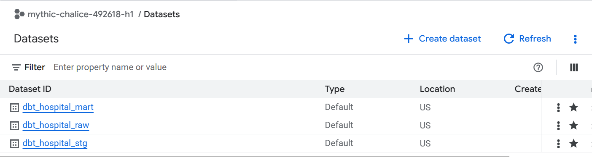
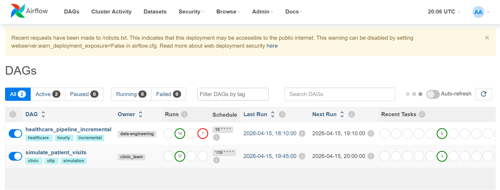
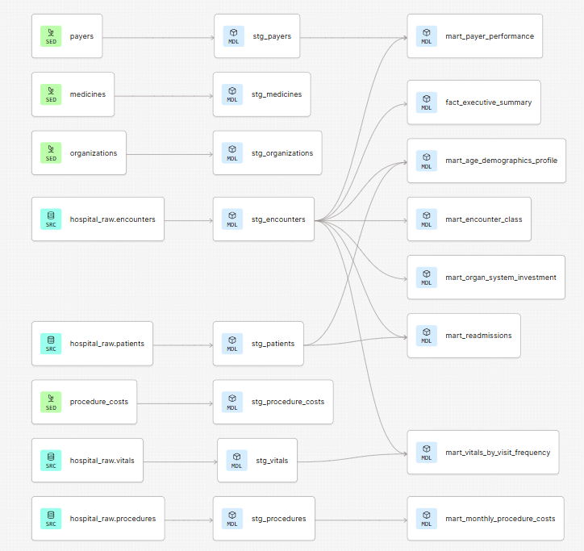
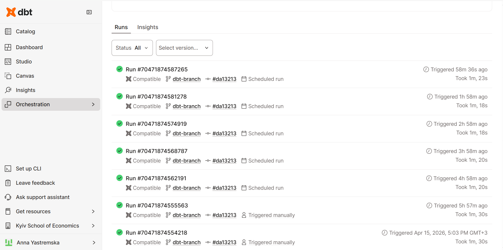
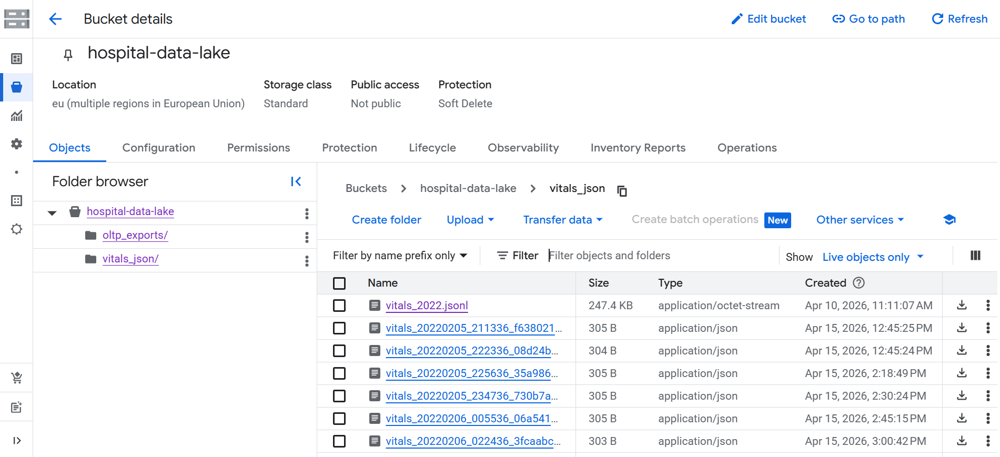
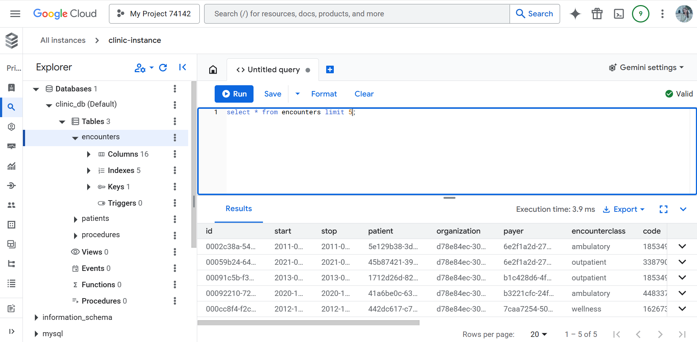
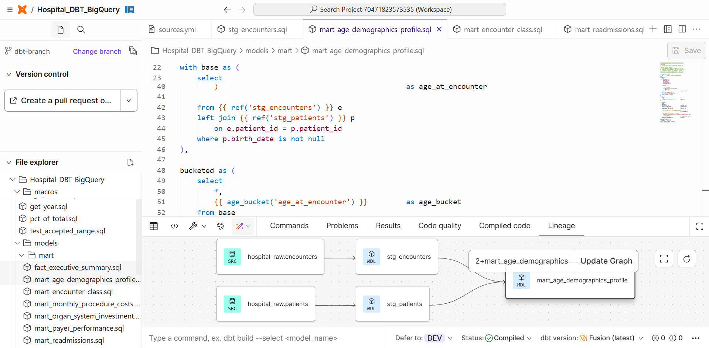
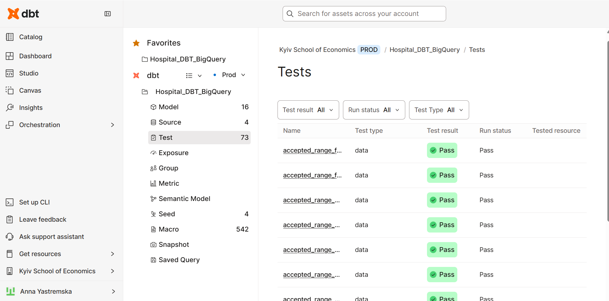
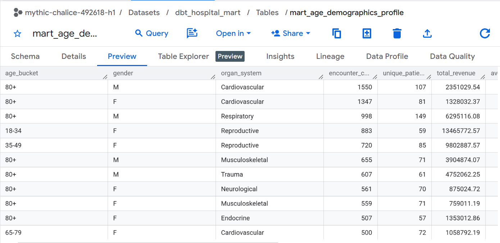
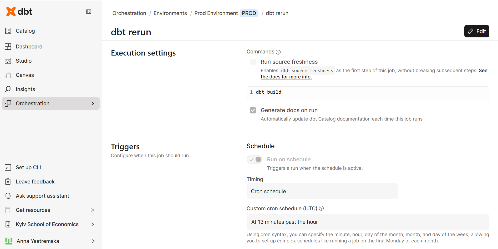

# 🏥 Hospital Data Platform

> An end-to-end healthcare analytics pipeline — from simulated OLTP events to a live executive dashboard — built on Google Cloud, Apache Airflow, dbt, and Looker Studio.

---

## Table of Contents

1. [Project Overview](#project-overview)
2. [Architecture](#architecture)
3. [Tech Stack](#tech-stack)
4. [Data Flow](#data-flow)
5. [Repository Structure](#repository-structure)
6. [Pipeline Components](#pipeline-components)
   - [Simulation DAG](#1-simulation-dag-simulate_patient_visits)
   - [ETL DAG](#2-etl-dag-healthcare_pipeline_incremental)
   - [dbt Staging Layer](#3-dbt-staging-layer)
   - [dbt Mart Layer](#4-dbt-mart-layer)
   - [dbt Tests & Macros](#5-dbt-tests--macros)
7. [BigQuery Datasets](#bigquery-datasets)
8. [dbt Cloud Orchestration](#dbt-cloud-orchestration)
9. [Looker Studio Dashboard](#looker-studio-dashboard)
10. [Key Business Questions Answered](#key-business-questions-answered)
11. [Setup & Running](#setup--running)
12. [What's Next / Possible Improvements](#whats-next--possible-improvements)

---

## Project Overview



This project simulates a real-world hospital data engineering workflow. It continuously generates synthetic patient encounters, routes them through a multi-hop pipeline, transforms raw clinical data into clean analytical marts with dbt, and surfaces insights in a live Looker Studio dashboard.

**Key highlights:**
- Fully automated, incremental pipeline — no manual interventions required
- 73 dbt data quality tests, all passing in production
- 8 analytical marts covering executive KPIs, clinical quality, financial exposure, and demographic profiling
- Live Looker Studio report connected directly to BigQuery mart tables

### 📊 Dashboard

- [Interactive Version (Looker Studio)](https://datastudio.google.com/reporting/6bac9074-a888-4066-94c7-3f48dce74a10)  
- [Static PDF Version](docs/Looker_Studio_Report.pdf)

---

## Architecture

The platform is organised into six logical layers:

| Layer | Component | Role |
|---|---|---|
| ① Simulation | Airflow `simulate_patient_visits` | Generates new encounters every 15 minutes into Cloud SQL + GCS |
| ② Raw | BigQuery `dbt_hospital_raw` | Landing zone for all source tables, loaded via incremental ETL |
| ③ Staging | dbt views in `dbt_hospital_stg` | Rename, cast, and lightly clean raw tables |
| ④ Mart | dbt tables in `dbt_hospital_mart` | Business-ready aggregated tables for analytics |
| ⑤ Orchestration | dbt Cloud (hourly cron) | Rebuilds marts and runs all 73 tests every hour |
| ⑥ Visualization | Looker Studio | 3-page interactive Clinic Report |

---

## Tech Stack



| Tool | Purpose |
|---|---|
| **Google Cloud SQL (MySQL)** | OLTP source — stores live encounter and procedure records |
| **Google Cloud Storage** | Data lake — stores vitals as JSONL files |
| **Apache Airflow (Cloud Composer)** | Orchestrates simulation and incremental ETL DAGs |
| **Google BigQuery** | Cloud data warehouse — raw, staging, and mart datasets |
| **dbt Core / dbt Cloud** | SQL transformations, testing, documentation, scheduling |
| **Looker Studio** | BI dashboards connected live to BigQuery marts |



---

## Data Flow

```
                    Every 15 min                  Hourly
  ┌─────────────────────────────┐     ┌──────────────────────────────┐
  │  Airflow: simulate_visits   │     │  Airflow: healthcare_pipeline│
  │  • generate encounter       │     │  • Extract from Cloud SQL    │
  │  • pick procedures from BQ  │     │    (watermark-based)         │
  │  • save to Cloud SQL        │────>│  • Transform (clean, validate)│
  │  • save vitals JSONL to GCS │     │  • Load to BQ raw (WRITE_APPEND)│
  └─────────────────────────────┘     └──────────────────────────────┘
                                                      │
                                                      ▼
                                        BigQuery: dbt_hospital_raw
                                        (encounters, procedures, patients,
                                         vitals, payers, medicines, ...)
                                                      │
                                              dbt build (hourly)
                                                      │
                                  ┌───────────────────┴──────────────────┐
                                  ▼                                       ▼
                        dbt_hospital_stg (views)              dbt_hospital_mart (tables)
                        stg_encounters                         fact_executive_summary
                        stg_patients                           mart_organ_system_investment
                        stg_procedures                         mart_encounter_class
                        stg_vitals                             mart_payer_performance
                        stg_payers                             mart_readmissions
                        stg_medicines                          mart_age_demographics_profile
                        stg_organizations                      mart_vitals_by_visit_frequency
                        stg_procedure_costs                    mart_monthly_procedure_costs
                                                                          │
                                                                          ▼
                                                              Looker Studio Clinic Report
                                                              (3 pages, live BigQuery connector)
```


---

## Repository Structure

```
hospital-data-platform/
│
├── airflow_dags/
│   ├── simulate_visits_dag.py          # Simulation: generates synthetic encounters every 15 min
│   └── healthcare_pipeline_dag.py      # ETL: Cloud SQL → BigQuery incremental pipeline
│
├── dbt/
│   ├── dbt_project.yml                 # Project config (schemas: raw / stg / mart)
│   ├── models/
│   │   ├── sources.yml                 # BigQuery source declarations
│   │   ├── stg/                        # Staging views
│   │   │   ├── schema.yml              # Tests: unique, not_null, FK relationships
│   │   │   ├── stg_encounters.sql
│   │   │   ├── stg_patients.sql
│   │   │   ├── stg_procedures.sql
│   │   │   ├── stg_vitals.sql
│   │   │   ├── stg_payers.sql
│   │   │   ├── stg_organizations.sql
│   │   │   ├── stg_medicines.sql
│   │   │   └── stg_procedure_costs.sql
│   │   └── mart/                       # Analytical mart tables
│   │       ├── schema.yml              # Business tests & column docs
│   │       ├── fact_executive_summary.sql
│   │       ├── mart_organ_system_investment.sql
│   │       ├── mart_encounter_class.sql
│   │       ├── mart_payer_performance.sql
│   │       ├── mart_readmissions.sql
│   │       ├── mart_age_demographics_profile.sql
│   │       ├── mart_vitals_by_visit_frequency.sql
│   │       └── mart_monthly_procedure_costs.sql
│   ├── macros/
│   │   ├── age_bucket.sql              # Standardised age grouping
│   │   ├── pct_of_total.sql            # NULL-safe percentage macro
│   │   ├── get_year.sql                # Cross-adapter YEAR extraction
│   │   └── test_accepted_range.sql     # Custom generic test
│   ├── tests/
│   │   └── cost_accuracy_test.sql      # base_cost + procedures = total_claim_cost
│   └── seeds/
│       ├── organizations.csv
│       ├── payers.csv
│       ├── medicines.csv
│       └── procedure_costs.csv
```

---

## Pipeline Components

### 1. Simulation DAG: `simulate_patient_visits`

**Schedule:** every 15 minutes  
**File:** `airflow_dags/simulate_visits_dag.py`

This DAG continuously feeds the OLTP database with realistic synthetic data. It mimics real-world hospital traffic with weighted encounter class distributions and clinically plausible vitals profiles.

**How it works:**

```python
# Weighted encounter class selection — imitates real hospital volume distribution
ENCOUNTER_CLASSES = ["ambulatory", "outpatient", "wellness", "urgentcare", "emergency", "inpatient"]
ENCOUNTER_CLASS_WEIGHTS = [12537, 6300, 1931, 3666, 2322, 1135]

enc_class = random.choices(ENCOUNTER_CLASSES, weights=ENCOUNTER_CLASS_WEIGHTS, k=1)[0]
```

```python
# Emergency patients have elevated heart rate and temperature vs. wellness visits
VITALS_PROFILES = {
    "emergency":  {"hr": (105, 15), "o2": (95, 2),  "temp": (38.1, 0.4), ...},
    "wellness":   {"hr": (68, 8),   "o2": (98, 1),  "temp": (36.6, 0.2), ...},
}
```

```python
# Procedure costs are fetched live from BigQuery — not hardcoded
all_procedures = fetch_procedure_costs()  # queries dbt_hospital_raw.procedure_costs
selected_procs = random.sample(all_procedures, random.randint(1, 3))
```

**Task graph:**

```
generate_data ──┬──> save_to_cloudsql  (encounters + procedures → MySQL)
                └──> save_vitals_to_gcs (vitals JSONL → GCS hospital-data-lake)
```

**GCS bucket output:**

The `hospital-data-lake` GCS bucket receives per-encounter JSONL vitals files at:
```
vitals_json/vitals_YYYYMMDD_HHMMSS_<encounter_id[:8]>.jsonl
```

---


### 2. ETL DAG: `healthcare_pipeline_incremental`

**Schedule:** hourly at `:10`  
**File:** `airflow_dags/healthcare_pipeline_dag.py`

Incrementally syncs new rows from Cloud SQL into BigQuery using a **watermark pattern** — only rows newer than the last successful sync are extracted.

```python
# Watermark-based incremental extraction — no full table scans
last_sync = Variable.get(WATERMARK_KEY, default_var="2000-01-01T00:00:00+00:00")

enc_df = mysql.get_pandas_df(
    "SELECT ... FROM encounters WHERE start > %s ORDER BY start",
    parameters=(last_sync,),
)
```

```python
# After successful load, advance the watermark
watermark = pd.Timestamp(max_ts).astimezone(timezone.utc).strftime("%Y-%m-%d %H:%M:%S")
Variable.set(WATERMARK_KEY, watermark)
```

**Task graph:**

```
start → extract → transform_enc ──┐
                 → transform_proc ─┴──> load → end
```

The `load` task uses `WRITE_APPEND` + BigQuery's native deduplication handled by dbt's `unique_key` constraints in downstream incremental models.



---

### 3. dbt Staging Layer



**Dataset:** `dbt_hospital_stg` (BigQuery views — zero storage cost)

Staging models perform three jobs: renaming columns to a consistent standard, casting types, and removing clearly invalid rows. Nothing is aggregated here.

```sql
-- stg_encounters.sql — representative example
select
    id                                          as encounter_id,
    patient                                     as patient_id,
    cast(start as datetime)                     as encounter_start_at,
    encounterclass                              as encounter_class,
    cast(total_claim_cost as numeric)           as total_claim_cost,
    NULLIF(organ_system, '')                    as organ_system   -- strip empty strings
from {{ source('hospital_raw', 'encounters') }}
```

**FK tests defined in schema.yml:**

```yaml
- name: encounter_id
  tests: [unique, not_null]
- name: patient_id
  tests:
    - relationships:
        to: ref('stg_patients')
        field: patient_id
```

---

### 4. dbt Mart Layer

**Dataset:** `dbt_hospital_mart` (BigQuery materialized tables)

Eight analytical marts, each answering specific business questions:

#### `fact_executive_summary`
Annual KPIs for leadership — visit volume, revenue, payer split, YoY growth.

```sql
-- YoY revenue growth using window functions
round(
    100.0 * (total_revenue - lag(total_revenue) over (order by encounter_year))
          / nullif(lag(total_revenue) over (order by encounter_year), 0),
    2
) as revenue_growth_pct_yoy
```

#### `mart_readmissions`
30-day readmission profiling via a self-join pattern:

```sql
-- Find the next encounter for the same patient after discharge
left join encounters nxt
    on  curr.patient_id        = nxt.patient_id
    and nxt.encounter_start_at > curr.encounter_end_at

-- Flag if it falls within 30 days
case
    when next_encounter_start <= DATETIME_ADD(curr_stop, INTERVAL 30 DAY)
    then true else false
end as readmitted_within_30d
```

#### `mart_age_demographics_profile`
Uses the shared `age_bucket()` macro for consistent segmentation across all marts:

```sql
-- From macros/age_bucket.sql
CASE
    WHEN age_at_encounter < 18  THEN '<18'
    WHEN age_at_encounter < 35  THEN '18-34'
    WHEN age_at_encounter < 50  THEN '35-49'
    WHEN age_at_encounter < 65  THEN '50-64'
    WHEN age_at_encounter < 80  THEN '65-79'
    ELSE '80+'
END
```

#### `mart_monthly_procedure_costs` — Incremental model
The highest-volume mart uses dbt's incremental materialization to avoid full rebuilds:

```sql
{{ config(
    materialized     = 'incremental',
    unique_key       = ['year_month', 'procedure_description'],
    on_schema_change = 'append_new_columns',
) }}


where pr.procedure_start_at > (
    select max(procedure_start_at_max) from {{ this }}
)

```

---

### 5. dbt Tests & Macros



**Custom macros:**

| Macro | Purpose | Used in |
|---|---|---|
| `age_bucket(col)` | Standard age grouping into 6 buckets | mart_age_demographics_profile, mart_readmissions |
| `pct_of_total(num, denom)` | NULL-safe `ROUND(100.0 * num / NULLIF(denom,0), 2)` | All 8 mart models |
| `get_year(col)` | `EXTRACT(YEAR FROM col)` — adapter-safe | fact_executive_summary, mart_encounter_class, mart_organ_system_investment |
| `test_accepted_range` | Custom generic test for range validation | pct fields (0–100), vitals, avg_days_to_readmission |

**Custom singular test:**

```sql
-- tests/cost_accuracy_test.sql
-- base_encounter_cost + procedures_total must equal total_claim_cost (tolerance: 0.01)
select encounter_id, ...
from stg_encounters
where abs((base_encounter_cost + procedures_total) - total_claim_cost) > 0.01
```

---

## BigQuery Datasets

Three datasets created by the pipeline:

| Dataset | Type | Contents |
|---|---|---|
| `dbt_hospital_raw` | Tables | Raw source data: encounters, procedures, patients, vitals, payers, medicines, organizations, procedure_costs |
| `dbt_hospital_stg` | Views | 8 staging views — renamed, cast, cleaned |
| `dbt_hospital_mart` | Tables | 8 analytical mart tables ready for BI consumption |




---

## dbt Cloud Orchestration



---

## Looker Studio Dashboard

### 📊 Dashboard

- [Interactive Version (Looker Studio)](https://datastudio.google.com/s/tchb87RWnYU)  
- [Static PDF Version](docs/your_report.pdf)

**Report:** Clinic Report (3 pages)  
**Data source:** BigQuery `dbt_hospital_mart` (live connector)

### Page 1 — Executive Summary
- Total encounters, unique patients, and revenue (KPI scorecards)
- Revenue and encounter volume trends by year
- Payer coverage split (% covered vs. out-of-pocket)
- YoY growth rates

### Page 2 — Performance & Investment Opportunities
- Top 5 organ systems by revenue over time (area chart)
- Most Often Affected Organ Systems — ranked table for 2021
- Total revenue and average claim cost by encounter class (treemap)
- Revenue and visit count by age group (bar chart)

### Page 3 — Statistical Information
- Most frequently performed procedures over time (line chart)
- Insurance coverage distribution (pie chart — Medicare dominates at 61.7%)
- Visit frequency vs. average temperature scatter
- Readmission rate by race and gender (bar chart)

---

## Key Business Questions Answered

| Question | Mart |
|---|---|
| Are visit volumes growing year-over-year? | `fact_executive_summary` |
| Which organ systems drive the most revenue? Should we invest in cardiac equipment? | `mart_organ_system_investment` |
| Has the share of emergency/inpatient visits changed? | `mart_encounter_class` |
| Which payers leave the most cost to patients? | `mart_payer_performance` |
| Which patient profiles are most likely to be readmitted within 30 days? | `mart_readmissions` |
| Where should preventive care programmes be targeted by age and gender? | `mart_age_demographics_profile` |
| Are high-frequency visitors genuinely sicker (worse vitals)? | `mart_vitals_by_visit_frequency` |
| Which procedures are driving cost growth month-over-month? | `mart_monthly_procedure_costs` |

---

## Setup & Running

### Prerequisites

- Google Cloud project with BigQuery, Cloud SQL, GCS, and Cloud Composer enabled
- dbt Cloud account connected to the BigQuery project
- Python 3.9+ with the packages in `requirements.txt`

### Airflow Connections Required

| Connection ID | Type | Purpose |
|---|---|---|
| `cloudsql_clinic` | MySQL | Cloud SQL `clinic_db` |
| `google_cloud_default` | Google Cloud | BigQuery + GCS access |

### Airflow Variables Required

| Variable | Example Value |
|---|---|
| `gcs_bucket` | `hospital-data-lake` |
| `BQ_PROJECT` | `mythic-chalice-492618-h1` |
| `BQ_DATASET_RAW` | `dbt_hospital_raw` |
| `bq_sync_watermark_hourly` | `2022-01-01 00:00:00` (initial seed) |

### dbt Setup

```bash
cd dbt/
dbt deps
dbt seed          # loads payers, organizations, medicines, procedure_costs CSVs
dbt build         # runs all models + all 73 tests
```

### Running just the marts

```bash
dbt build --select mart
```

### Running with test output

```bash
dbt build --store-failures
```

---

## What's Next / Possible Improvements

- **Alerting:** Add dbt Cloud webhooks or Airflow email alerts for test failures or stale data
- **ML integration:** Use `mart_readmissions` and `mart_vitals_by_visit_frequency` as feature tables for a readmission risk model (Vertex AI)

---

*Built with Google Cloud · Apache Airflow · dbt · BigQuery · Looker Studio*
